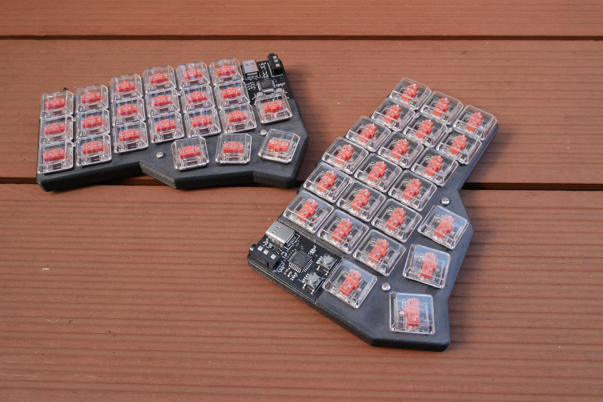
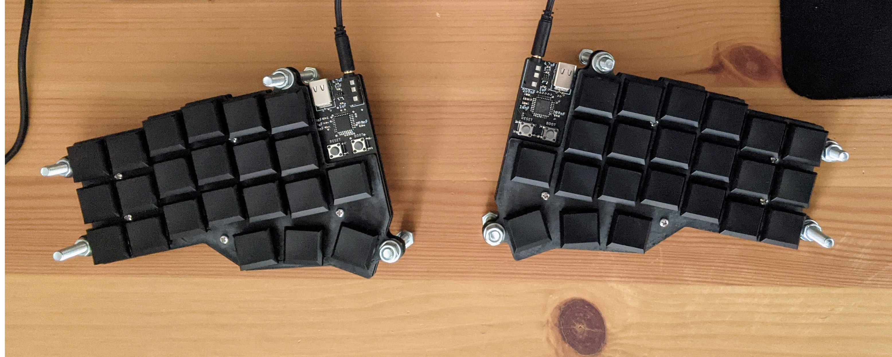
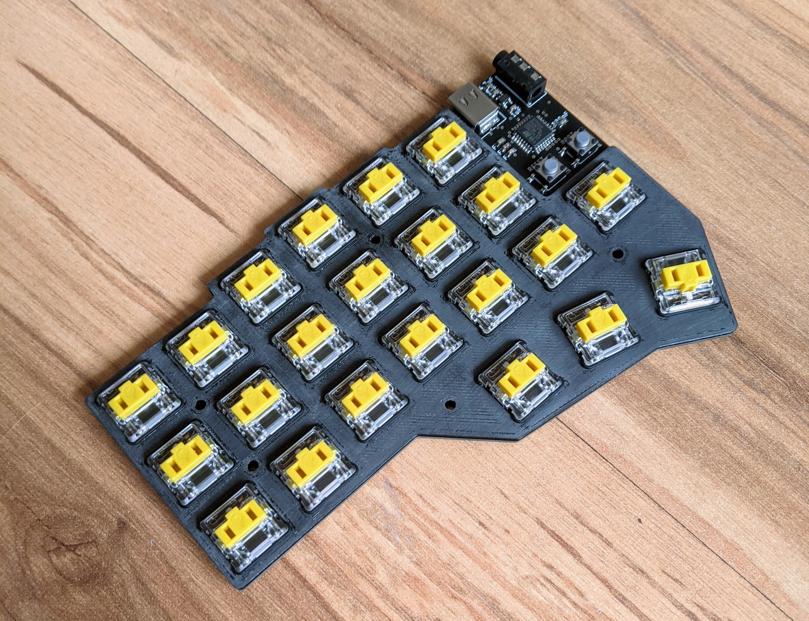

# Vagabond 44 split keyboard (vgbd44)

An affordable, 44-key low-profile split mechanical keyboard using kailh choc switches with (optional) hot-swap and pure Rust firmware.

Inspired by: 
 - [crkbd](https://github.com/foostan/crkbd) - overall keyboard shape, case mounting
 - [lily58](https://github.com/kata0510/Lily58) - additional thumb button
 - [keyseebee](https://github.com/TeXitoi/keyseebee) - firmware, switches

## Goals:
 - Portability
 - Very low profile - contributes towards portability, minimum hand strain
 - Affordable - no fancy and expensive parts, minimum 'extra' features
 - Easy to build - all of the components are hand-solderable
 - Easily sourceable components
 - Simple schematic and PCB
 - Simple and user-friendly firmware (written in Rust)
 - 3D printable case+plate - designed for painless printing even on non-professional printers
 - Optional hot-swap sockets - hot-swap is useful, but not everyone needs it
 - USB-C sockets - the new standard; one less reason to keep legacy cables around

## Non-goals:
 - No backlighting - less distracting keyboard, simpler design and firmware, easier to build
 - No ESD/overvoltage/etc protection - much more affordable, very rarely needed when the keyboard is used under normal conditions
 - No reversible PCB - heavily complicates PCB design and the building process; doesn't make manufacturing PCBs cheaper in most cases

### Extra features:
 - TRRS sockets at the top - doesn't require angled jacks, and the cable doesn't get in the way
 - +3V3, GND and a single GPIO pin breakout (for one-wire RGB LEDs or other custom features)
 - Test pads for debugging

## Resources
 - The firmware is located in the [vgbd44-firmware](https://github.com/Skelebot/vgbd44-firmware) repository.
   Head there for instructions on flashing and other firmware-related resources.
 - Case options and other notes on cases: [CASES.md](docs/CASES.md)
 - Layout info and printable layout diagrams: [LAYOUT.md](docs/LAYOUT.md)

## Parts list (BOM)
The parts list is also available [here](https://docs.google.com/spreadsheets/d/1f-E3JmmYUamYBCyl46FBLJGFHlAR0pfU8PB9eaqT7j0/edit?usp=sharing)
in spreadsheet form.

This table is a parts list for a full keyboard, with *estimate, rounded up* prices in EUR.

|Item |Remarks |Qty |Price (for exact qty) |
|---|---|--:|--:|
|[left PCB](eagle/CAMOutputs/left-gerber.zip), [right PCB](eagle/CAMOutputs/right-gerber.zip) | | 1, 1| 18.00|
|1N4148 diodes |MINIMELF package (or footprint-compatible) | 44| 0.50|
|100nF capacitor |0603 package | 6| 0.05|
|10nF capacitor |0603 package | 2| 0.01|
|1uF capacitor |0603 package | 4| 0.02|
|4.7uF capacitor |0603 package | 4| 0.02|
|10k resistor |0603 package | 2| 0.01|
|5.1k resistor |0603 package | 4| 0.02|
|MIC5504-3.3 or compatible |SOT23-5 package | 2| 0.24|
|6mm OFF-(ON) SMD button |for example PTS645SH50SMTR92 | 2| 0.40|
|PJ320A 3.5mm jack socket |easy to get on aliexpress | 2| 0.30|
|217B-AG01 USB-C socket | | 2| 4.00|
|STM32F042K6T6 or compatible |see notes in [firmware](https://github.com/Skelebot/vgbd44-firmware) | 2| 6.00|
|**Mechanical parts**|
|4mm M2 screws |for example M2X4/D7985-A2 | 20| 0.22|
|5mm M2 standoffs |for example TFF-M2X5/DR111 | 10| 2.00|

Which equals about **13.80 EUR** for a single keyboard (both halves).
For a full keyboard one would also (obviously) need switches and keycaps, which can
and usually are the most expensive part of a keyboard.

Other optional and/or extra parts are:
 - Kailh choc hotswap sockets (one per key)
 - USB-C cable (1)
 - TRRS cable (1)

## Photos:

