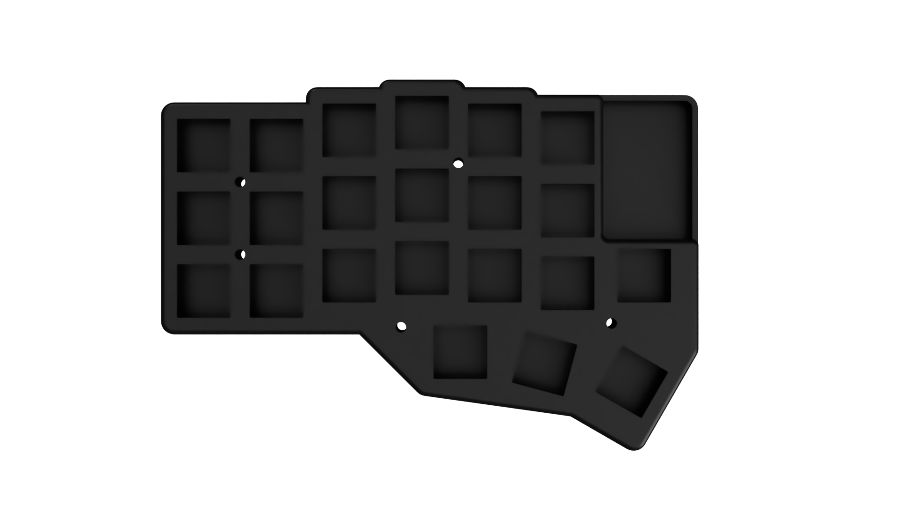
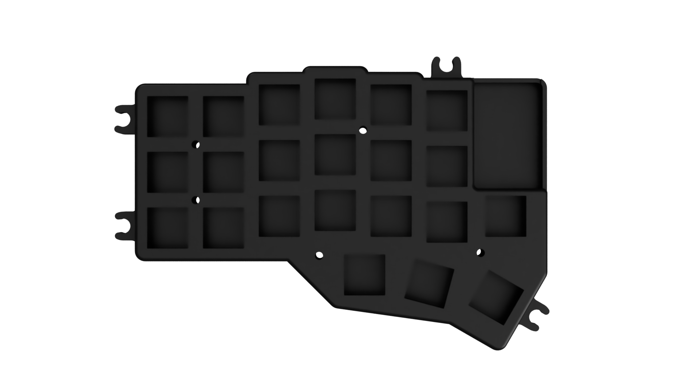

# Cases
3D design files for printing the cases are located in the [3D](../3D) folder.

Both the compact case and the tenting case have a 2mm thick plate, which is flush with both the PCB and the switch,
to ensure stability and that it doesn't bend, meaning that the flexibility of the material doesn't make much difference.

## Compact case

Minimal printable case - very light, minimal material needed

## Case with tenting snaps

 - Identical as the compact case, but has 4 protrusions on the sides that fit standard M5 bolts.
 - Can be used with or without the "tenting poles" attached, and the poles can be attached without unscrewing nuts.
 - "Tenting poles" consist of a single M5 bolt of 30-60mm length with 2 nuts and optionally a washer or two.
 - A rubber bumper sticked on the head prevents the keyboard from sliding.

## Photos

Assembled tenting case with legs attached
